# 系統架構與全端資料流向指南

本文檔詳細記錄了 CryptoSniper v2 **10 大核心資料流向 (Data Flows)** 與關鍵架構設計。

這些流向設計涵蓋了 DevOps CI/CD 自動化、邊界安全路由、第三方身分合併事務、JWT 認證與 Session 安全、自適應行情拉取、高併發行情削峰去重、多時框策略篩選引擎、量化回測引擎與非同步任務管線、全域可觀測性監控，以及 NestJS 全域請求管線架構。

---

## 目錄

1. [開發與 CI/CD 自動化部署流向 (CI/CD Deployment Flow)](#1-開發與-cicd-自動化部署流向-cicd-deployment-flow)
2. [使用者存取與邊界路由流向 (User Traffic & Routing Flow)](#2-使用者存取與邊界路由流向-user-traffic--routing-flow)
3. [第三方 OAuth 登入與帳號綁定合併流程 (OAuth & Account Linking Flow)](#3-第三方-oauth-登入與帳號綁定合併流程-oauth--account-linking-flow)
4. [認證與 Session 安全生命週期流向 (Authentication & Session Lifecycle Flow)](#4-認證與-session-安全生命週期流向-authentication--session-lifecycle-flow)
5. [幣安行情資料抓取與限流自適應調度流程 (Binance Ingestion & Rate Limit Flow)](#5-幣安行情資料抓取與限流自適應調度流程-binance-ingestion--rate-limit-flow)
6. [即時行情告警比對與多管道推送流程 (Real-time Alert & Push Flow)](#6-即時行情告警比對與多管道推送流程-real-time-alert--push-flow)
7. [策略篩選引擎資料流向 (Screener Strategy Engine Flow)](#7-策略篩選引擎資料流向-screener-strategy-engine-flow)
8. [系統可觀測性與監控數據流向 (Observability & Monitoring Data Flow)](#8-系統可觀測性與監控數據流向-observability--monitoring-data-flow)
9. [NestJS 全域請求管線架構 (Global Request Pipeline Architecture)](#9-nestjs-全域請求管線架構-global-request-pipeline-architecture)
10. [資料庫實體關係圖 (Database ER Diagram)](#10-資料庫實體關係圖-database-er-diagram)
11. [Redis 快取與佇列架構設計 (Redis Architecture & Cache Design)](#11-redis-快取與佇列架構設計-redis-architecture--cache-design)
12. [量化回測引擎與非同步任務流向 (Backtest Engine & Async Pipeline Flow)](#12-量化回測引擎與非同步任務流向-backtest-engine--async-pipeline-flow)

---

## 1. 開發與 CI/CD 自動化部署流向 (CI/CD Deployment Flow)

本專案實踐了「基礎設施即程式碼 (IaC)」與零手動部署流程，確保每次發布均經過嚴格驗證並無縫升級。

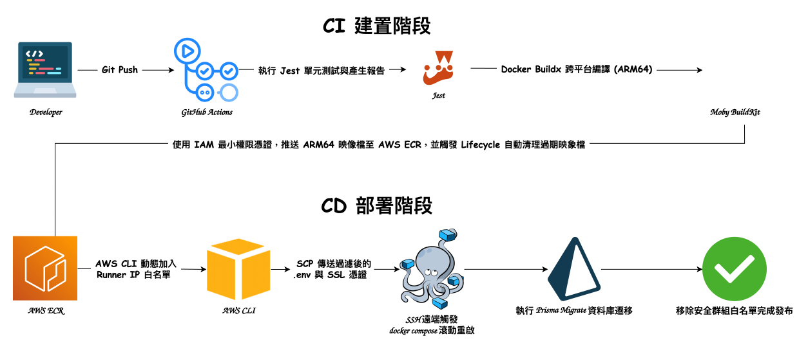

```
[本機開發者]
   │ (git push)
   ▼
[GitHub Actions CI/CD Pipeline]
   │ 1. 執行 Jest 單元測試與產生測試報告
   │ 2. Docker Buildx 跨平台編譯 (專為 AWS Graviton 構建 ARM64 架構)
   ▼
[AWS ECR 私有映像檔庫]
   │ 3. 使用 IAM 最小權限憑證推播 API / Web 映像檔 (觸發 Lifecycle 自動清理過期垃圾)
   ▼
[AWS EC2 生產伺服器]
   │ 4. AWS CLI 動態授權 Runner IP 進入 EC2 安全群組
   │ 5. SCP 自動傳送過濾後的 .env 與 Cloudflare 源站 SSL 憑證
   │ 6. SSH 觸發 `docker compose pull && up -d` 滾動重啟
   │ 7. 自動執行 `bunx prisma migrate deploy` 完成資料庫遷移
   ▼
[完成自動化發布並移除防火牆白名單]
```

---

## 2. 使用者存取與邊界路由流向 (User Traffic & Routing Flow)

為防禦 DDoS 並確保 SSL 加密，系統在邊界網路層配置了「隱形源站」與動態反向代理：

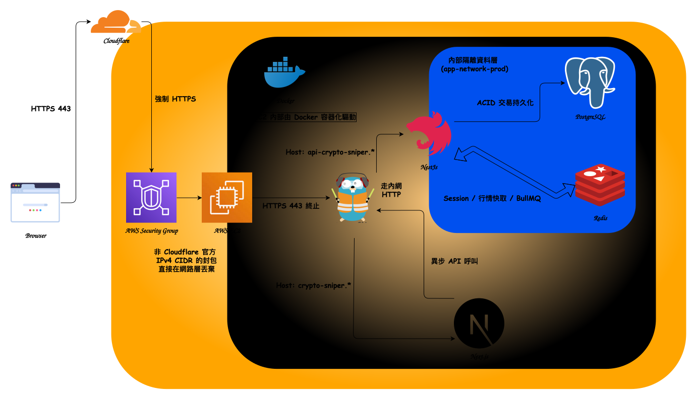

```
[使用者瀏覽器 / 外部客戶端]
   │ HTTPS (443 Port)
   ▼
[Cloudflare CDN / WAF 邊界防禦]
   │ 強制 HTTPS SSL 終止、DDoS 過濾
   ▼
[AWS EC2 安全群組 + VPC 受管前綴清單]
   │ 白名單過濾：非 Cloudflare 官方 IPv4 CIDR 的封包直接在網路層丟棄 (Drop)，且不開放 80 埠
   ▼
[Docker Traefik 網關 (traefik-public 網路)]
   │ 載入 Cloudflare 源站憑證，依據 Subdomain 進行動態分流
   ├──► 請求 `crypto-sniper.*` ────► [Next.js Web 容器] (SSR 渲染網頁回傳)
   └──► 請求 `api-crypto-sniper.*` ──► [NestJS API 容器]
                                            │
               ┌────────────────────────────┴────────────────────────────┐
               ▼                                                         ▼
    [Redis 快取/佇列容器]                                    [PostgreSQL 資料庫容器]
  (JWT Session、行情快取、BullMQ 佇列)                        (ACID 交易持久化儲存)
```

---

## 3. 第三方 OAuth 登入與帳號綁定合併流程 (OAuth & Account Linking Flow)

當使用者使用 Google、Discord 或 Telegram 進行登入或個人中心綁定時，系統採用了高安全性的狀態校驗機制與資料庫原子事務 (Database Transaction)，解決「臨時帳號與主帳號衝突合併」的問題。

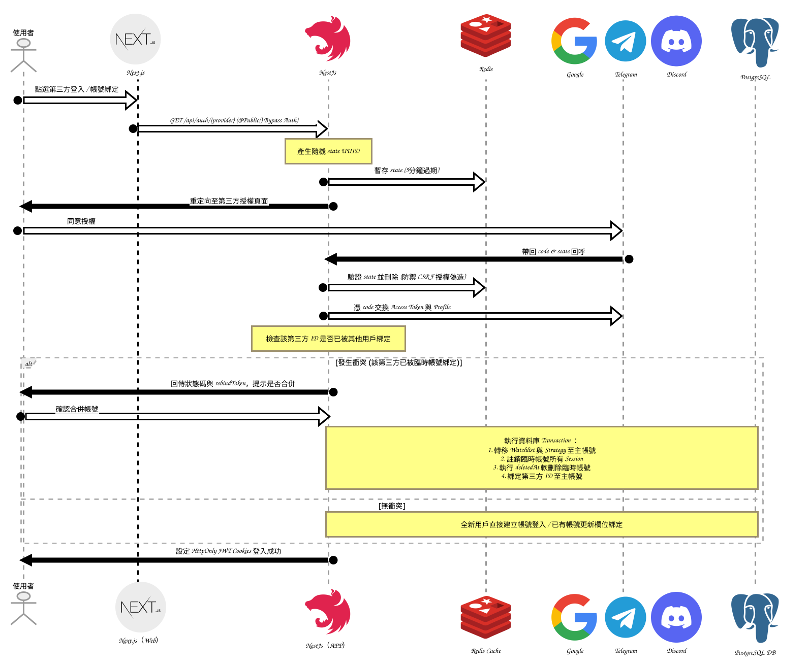

### 流程詳解：

1. **發起授權請求**：使用者點擊登入/綁定，後端產生一組隨機的 UUID 作為 `state`，並將其暫存於 Redis（設定 5 分鐘過期），記錄此請求屬於「登入 (Login)」還是「綁定 (Link)」，隨後將使用者導向第三方授權頁面。
2. **回呼防禦驗證**：授權成功後第三方帶回 `code` 與 `state`。後端檢驗 Redis 中的 `state` 是否合法存在，防範 CSRF 授權偽造攻擊。
3. **身分判斷與分支路由**：
   - **全新用戶**：直接在資料庫建立新帳號並核發 JWT 登入。
   - **已有帳號且未綁定**：直接更新目前主帳號的第三方 ID 欄位完成綁定。
   - **衝突處理（帳號合併機制）**：若該第三方帳號先前已被另一個「臨時帳號」綁定：
     1. 系統暫停綁定，回傳一個安全的 `rebindToken` 給前端。
     2. 使用者在前端確認執行「帳號合併」後，後端開啟 Prisma 原子事務 `prisma.$transaction`：
        - **資產轉移**：將臨時帳號名下的「追蹤清單 (Watchlist)」與「儲存策略 (SavedStrategy)」轉移並合併至當前主要帳號。
        - **強制登出**：清除 Redis 中該臨時帳號的所有 Session 授權。
        - **合規軟刪除**：遵循資料庫安全政策，以 `deletedAt` 軟刪除 (Soft-delete) 該臨時帳號，確保審計軌跡不遺失。
        - **完成綁定**：將第三方 ID 正式轉移綁定至當前主要帳號。

---

## 4. 認證與 Session 安全生命週期流向 (Authentication & Session Lifecycle Flow)

系統採用 **雙 Token 架構 (Dual Token Architecture)** 搭配 **HttpOnly Secure Cookie** 傳輸機制，並在 Refresh Token 層實作了旋轉更新 (Rotation)、Session 劫持偵測與前端 SSR 層路由守衛。

### 架構圖：

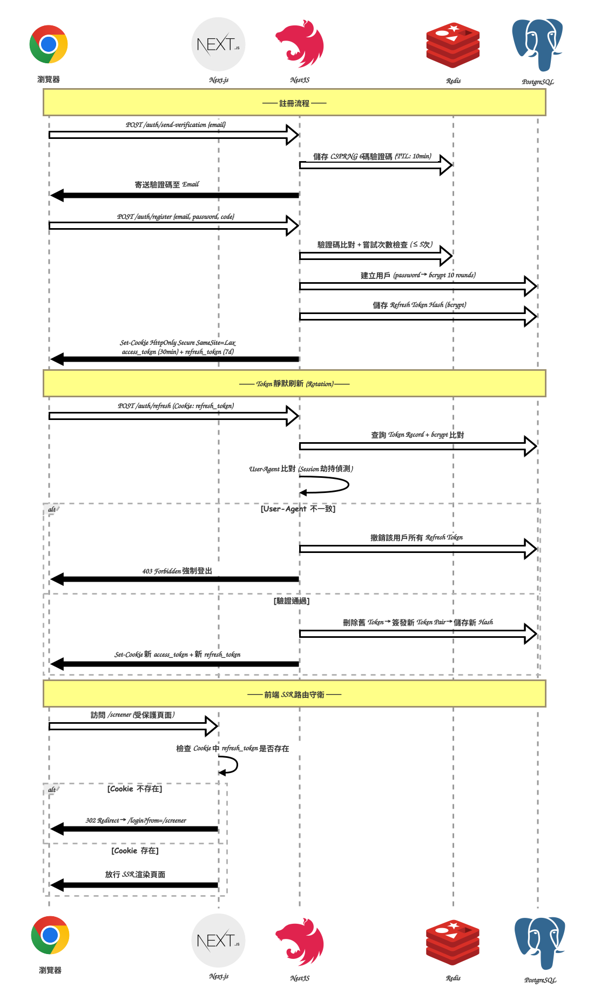

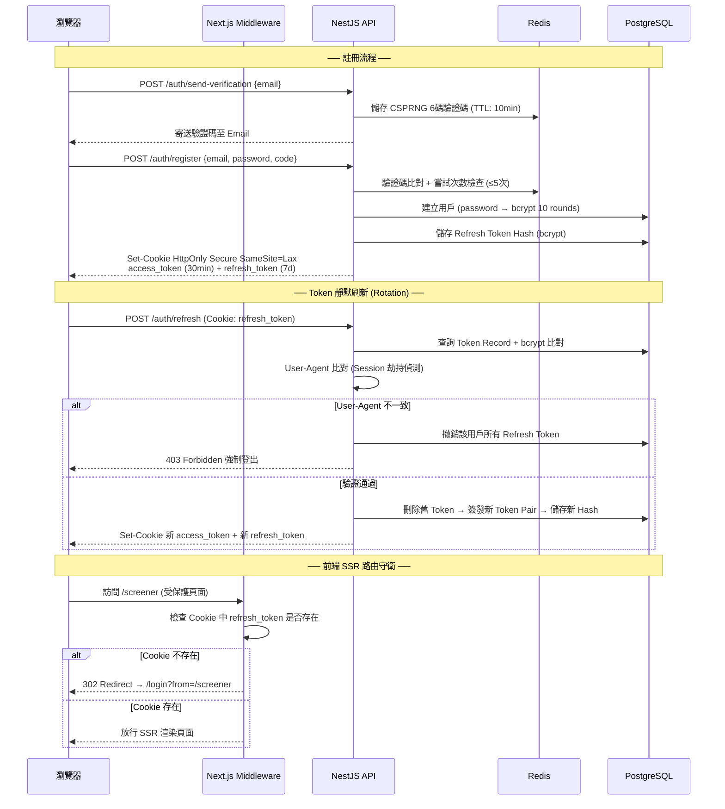

### 核心安全設計要點：

1. **HttpOnly Secure Cookie**：JWT Token 不使用 `localStorage`（易受 XSS 攻擊竊取），而是寫入 `httpOnly: true`、`secure: true`、`sameSite: 'lax'` 的 Cookie，瀏覽器端 JavaScript 完全無法讀取。
2. **Refresh Token 旋轉 (Rotation)**：每次 Token 刷新時，舊 Refresh Token 從資料庫刪除並簽發全新 Token Pair。資料庫僅儲存 `bcrypt(refreshToken)` Hash 值，即使資料庫被洩漏也無法直接使用。
3. **Session 劫持偵測**：Refresh Token Record 記錄原始登入的 `User-Agent`。若刷新時的 `User-Agent` 與記錄不一致（可能為 Token 被竊取），系統立即撤銷該用戶所有裝置的登入 Session。
4. **Email 驗證碼防暴力破解**：驗證碼使用 `crypto.randomInt()` (CSPRNG) 產生，並在 Redis 中追蹤錯誤嘗試次數（上限 5 次），超限自動作廢驗證碼。
5. **Next.js Middleware 前端守衛**：在 SSR 層根據 `refresh_token` Cookie 的存在性決定是否放行受保護路由（`/screener`、`/watchlist`、`/alerts`、`/profile`），已登入用戶訪問 `/login` 則自動導回 `/screener`。

---

## 5. 幣安行情資料抓取與限流自適應調度流程 (Binance Ingestion & Rate Limit Flow)

行情數據抓取與指標計算是策略篩選看板（Screener）的基石。為了解決多時框（9 個）、多交易對（700+）高頻請求導致幣安 `429 Rate Limit` 封鎖的問題，系統在 `MarketScheduleService` 實作了冷熱分流、自適應權重延遲與主備援切換機制。

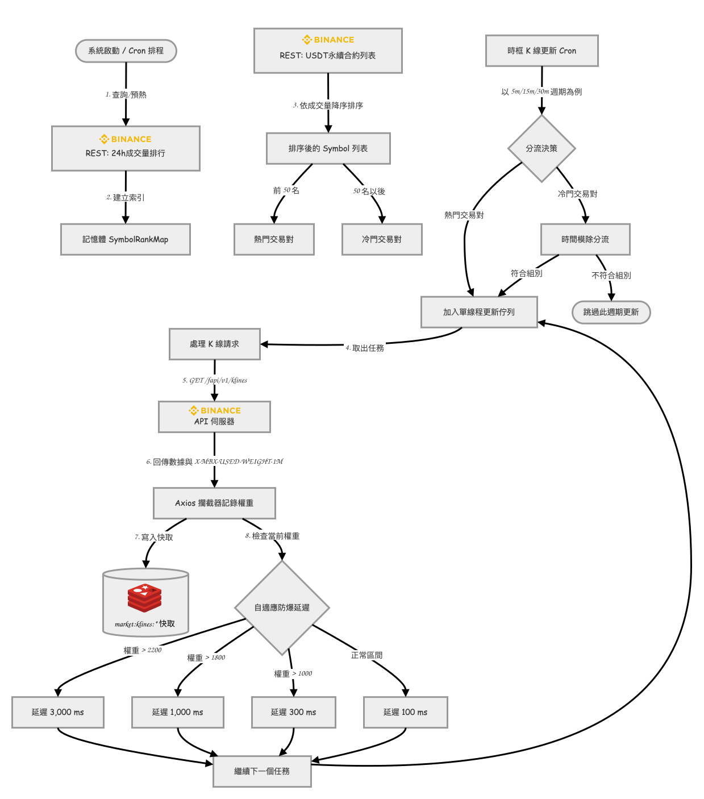

### 流程詳解：

1. **冷熱交易對分流 (Hot/Cold Separation)**：
   - 系統每 5 分鐘拉取並計算 24h 成交量排行（Volume Ranking）存入 Redis，前 50 名的交易對被標記為**熱門標的 (Hot)**，其餘為**冷門標的 (Cold)**。
   - 更新 5m、15m、30m 短週期 K 線時，熱門交易對每次均會更新；冷門交易對則依當前時間分鐘進行模除分組（如 5m 週期分成 3 組，每 5 分鐘只輪詢更新 1/3 的冷門交易對），從而在保障熱門標的即時性的同時，將冷門標的的 API 請求次數縮減為原來的 1/3。
2. **單執行緒排隊與自適應延遲 (Single-Threaded Queue & Adaptive Backoff)**：
   - 所有需要更新的 K 線任務統一進入一個記憶體佇列，由一個單執行緒迴圈依序執行，防止多執行緒併發請求爆額。
   - 使用 Axios 攔截器（Interceptor）實時攔截回應標頭中的 `X-MBX-USED-WEIGHT-1M`。每執行完一次請求，便判斷目前已耗用權重，動態調整請求間隔：
     - 權重 > 2,200 (接近 2,400 上限)：延遲 3,000ms
     - 權重 > 1,800：延遲 1,000ms
     - 權重 > 1,000：延遲 300ms
     - 正常情況：延遲 100ms
3. **主備援行情雙軌機制 (Push/Pull Hybrid)**：
   - 系統預設依賴 **WebSocket 行情訂閱**（單一長連線訂閱全市場 ticker，每秒即時推送）來更新 Redis 價格快取。
   - 每 10 秒觸發一次備援價格輪詢 Cron Job。該排程會先檢查 `BinanceWebsocketService.isAlive()`，若 WebSocket 連線正常，則**直接跳過 REST 請求**以省資源；僅在 WebSocket 假死或斷線超時 30 秒（觸發 Watchdog 指數退避重連）時，才啟動每 10 秒的批次 REST `GET /fapi/v1/ticker/price` 調用，確保存儲在 Redis 中的價格始終最新。

---

## 6. 即時行情告警比對與多管道推送流程 (Real-time Alert & Push Flow)

為了在有限的運算資源 (如 AWS EC2 `t4g.micro` 實例) 上承受加密貨幣市場極高頻的價格波動，告警引擎採用了**長連線看門狗、任務去重削峰 (Conflation) 與雙異步佇列**設計。

> [!NOTE]
> 當 WebSocket 長連線因網路異常中斷時，系統會啟動 REST 備援輪詢機制以更新 Redis 即時行情快取，防止前端看板價格凍結。詳細的切換與限流機制請參閱 [5. 幣安行情資料抓取與限流自適應調度流程](#5-幣安行情資料抓取與限流自適應調度流程-binance-ingestion--rate-limit-flow)。

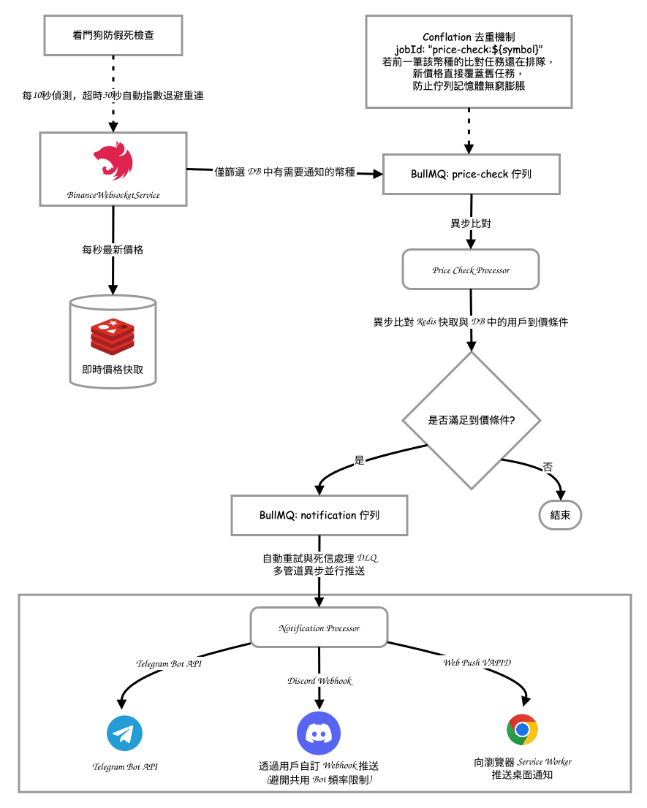

```
[Binance 幣安 WebSocket 伺服器]
   │ 1. 唯一長連線訂閱全市場即時報價
   ▼
[NestJS BinanceWebsocketService] ──► [防死看門狗 Watchdog] (每10秒心跳偵測，超時30秒自動指數退避重連)
   │
   │ 2. 行情異動過濾 (僅篩選 DB 中有活躍告警的幣種)
   ▼
[BullMQ 佇列：price-check]
   │    高頻削峰去重 (Conflation)：利用 `jobId: "price-check:${symbol}"`
   │    若前一筆該幣種的比對任務還在排隊，新價格直接覆蓋舊任務，防止佇列記憶體無窮膨脹
   ▼
[PriceCheck 消費者處理器]
   │ 3. 異步比對 Redis 快取與 DB 中的用戶到價條件
   ▼ (若觸發告警條件)
[BullMQ 佇列：notification]
   │ 4. 推入多管道通知任務
   ▼
[Notification 消費者處理器] ──(異步並行分流發送)──┐
   ├──► [Telegram Bot API] 向用戶推送 TG 訊息   │
   ├──► [Discord Webhook] 透過用戶自訂 Webhook 推送 (避開共用 Bot 頻率限制)
   └──► [Web Push VAPID] 向瀏覽器 Service Worker 推送桌面通知
```

---

## 7. 策略篩選引擎資料流向 (Screener Strategy Engine Flow)

Screener 是產品的核心功能，讓用戶在 700+ 個 USDT 永續合約中，透過自訂「多時框均線交叉條件」快速篩選出符合策略的標的。篩選引擎採用了**配置 Hash 快取、行情預熱偵測、併發批次控制與 K 線回退機制**。

### 架構圖：

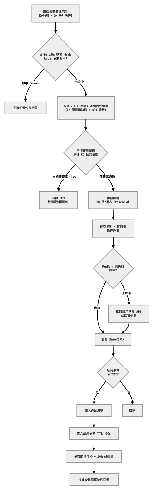

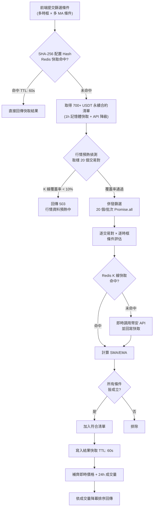

### 核心設計要點：

1. **配置 Hash 去重快取**：將篩選條件（時框、MA 類型、週期、運算子）結構化排序後以 `SHA-256` 雜湊，相同配置的請求直接命中 Redis 快取（TTL: 60s），大幅減少重複計算。
2. **行情預熱偵測 (Cache Warmup Detection)**：系統啟動後前幾分鐘 K 線快取尚未完備。Screener 在執行篩選前，優先依 24h 交易量排行前列與前 5 大主流錨點標的（BTC, ETH, SOL, BNB, XRP）檢查快取覆蓋率，若快取完全缺失，自動以 `getKlinesWithFallback` 觸發即時拉取補齊，僅在外部 API 完全無回應時才回傳 `503 Service Unavailable`，避免在系統剛啟動或冷門幣排序時誤判卡死。
3. **併發批次控制**：對 700+ 交易對的篩選以 20 個為一批次執行 `Promise.all`，防止同時發起數百個 Redis 查詢造成 Redis 連線池耗盡。
4. **K 線回退 (Fallback)**：若 Redis 中某交易對的 K 線快取已過期，Screener 會即時調用幣安 `GET /fapi/v1/klines` API 並回寫快取，確保篩選不因快取缺失而漏掉任何標的。
5. **交易對清單降級策略**：`BinanceService.getUSDTFuturesSymbols()` 自帶 1 小時的 in-memory 快取。當幣安 API 調用失敗時，降級回傳舊快取資料，避免全系統連鎖中斷。

---

## 8. 系統可觀測性與監控數據流向 (Observability & Monitoring Data Flow)

實踐了「動靜分離與內部隔離」的可觀測性架構，確保監控系統在提供高清晰度儀表板的同時，不暴露內部底層指標接口。

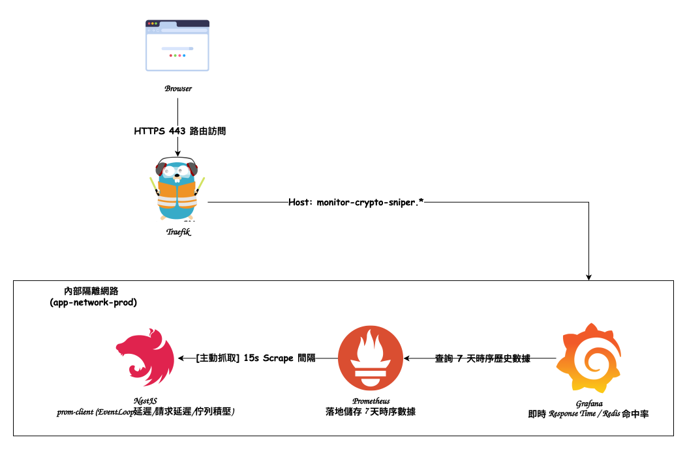

```
[NestJS API 應用程式] (安裝 prom-client 統計 Request 延遲、事件迴圈與佇列積壓)
   │ 暴露內部接口 `/metrics` (僅限內部網路訪問)
   ▼
[Prometheus 容器] (位於內部隔離網路 `app-network-prod`，不對外開放 Port)
   │ 定時每 15 秒主動抓取 (Scrape) 指標，並落地儲存 7 天時序歷史數據
   ▼
[Grafana 容器] (同時連接內部網路與外部 Traefik 網關)
   ▲
   │ 經由 Traefik 路由安全訪問 `monitor-crypto-sniper.yourdomain.com`
[開發者 / 運維人員瀏覽器] (在可視化圖表上即時監控 API Response Time、Redis 命中率與記憶體)
```

---

## 9. NestJS 全域請求管線架構 (Global Request Pipeline Architecture)

系統在 NestJS 框架上構建了一條**七層全域防禦管線**，每一層各司其職，從網路層攔截到資料層安全，實現縱深防禦 (Defense in Depth)。

### 架構圖：

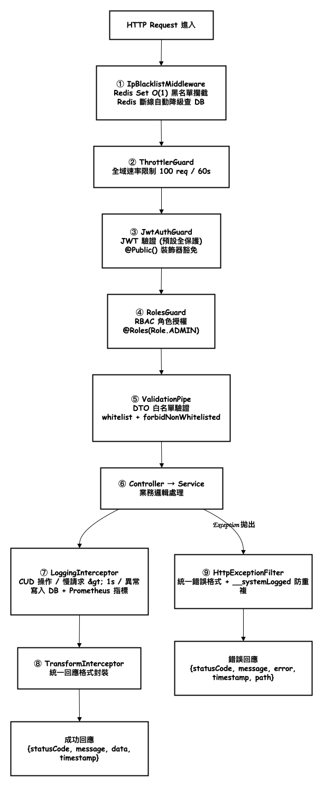

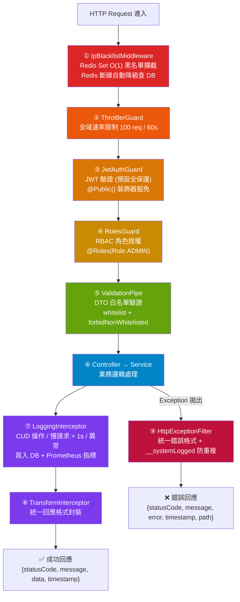

### 管線設計要點：

1. **IP 黑名單優先攔截**：`IpBlacklistMiddleware` 掛載在所有路由的最前端 (`forRoutes('*')`)，使用 Redis `SISMEMBER` 達成 O(1) 查詢效能。若 Redis 斷線，自動降級改查 PostgreSQL，安全防禦不中斷。
2. **預設全保護 (Secure by Default)**：`JwtAuthGuard` 作為全域 Guard，所有 API 預設需要 JWT 認證。僅透過 `@Public()` 裝飾器明確標記的端點才能匿名存取。
3. **Guard 執行順序**：遵循 `ThrottlerGuard → JwtAuthGuard → RolesGuard` 的順序，確保即使是未認證的大量惡意請求也先被速率限制攔截。
4. **日誌防重複寫入**：`LoggingInterceptor` 在記錄日誌後於 `request` 物件上設定 `__systemLogged = true` 標記。`HttpExceptionFilter` 在寫入前先檢查此標記，避免 Guard 層拋出的異常被兩個元件重複記錄，浪費資料庫連線池。
5. **`TransformInterceptor` 可跳過**：透過 `@SkipTransform()` 裝飾器，Prometheus `/metrics` 端點可直接回傳原始文字格式，不被封裝為 JSON。
6. **Prometheus 延遲載入**：`LoggingInterceptor` 透過 `ModuleRef.get(MetricsService, { strict: false })` 延遲解析 `MetricsService`，避免模組間循環依賴 (Circular Dependency)。
7. **真實 IP 透傳**：`app.set('trust proxy', true)` 讓 Express 正確解析 Cloudflare → Traefik → 容器的多層代理鏈，確保 `req.ip` 取得的是客戶端真實 IP 而非 Docker 內網 IP。
8. **敏感資料自動遮罩**：所有寫入 `SystemLog` 的 `requestBody` 均經過 `maskSensitiveData()` 遞迴深層淨化，45+ 個預定義敏感欄位（密碼、Token、卡號等）自動遮罩，防止合規風險。

---

## 10. 資料庫實體關係圖 (Database ER Diagram)

本系統使用 PostgreSQL 16 作為主要關聯式資料庫，並使用 Prisma ORM 進行資料庫操作。以下是系統實體的關係圖：

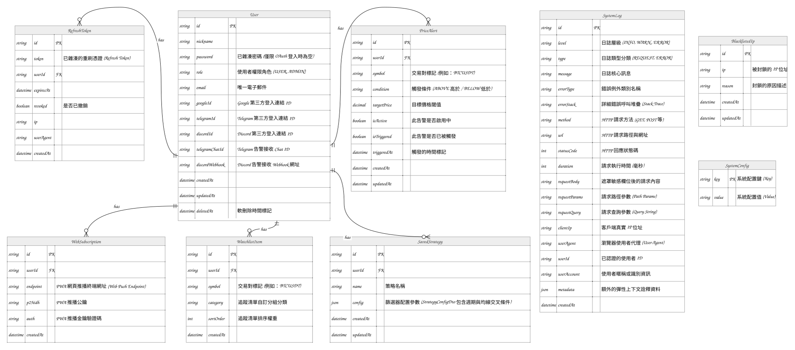

```mermaid
erDiagram
    User ||--o{ RefreshToken : "has"
    User ||--o{ WebSubscription : "has"
    User ||--o{ WatchlistItem : "has"
    User ||--o{ SavedStrategy : "has"
    User ||--o{ PriceAlert : "has"
    User ||--o{ BacktestJob : "has"

    User {
        string id PK
        string nickname
        string password "已雜湊密碼 (僅限 OAuth 登入時為空)"
        string role "使用者權限角色 (USER, ADMIN)"
        string email "唯一電子郵件"
        string googleId "Google 第三方登入連結 ID"
        string telegramId "Telegram 第三方登入連結 ID"
        string discordId "Discord 第三方登入連結 ID"
        string telegramChatId "Telegram 告警接收 Chat ID"
        string discordWebhook "Discord 告警接收 Webhook 網址"
        datetime createdAt
        datetime updatedAt
        datetime deletedAt "軟刪除時間標記"
    }

    RefreshToken {
        string id PK
        string token "已雜湊的重刷憑證 (Refresh Token)"
        string userId FK
        datetime expiresAt
        boolean revoked "是否已撤銷"
        string ip
        string userAgent
        datetime createdAt
    }

    WebSubscription {
        string id PK
        string userId FK
        string endpoint "PWA 網頁推播終端網址 (Web Push Endpoint)"
        string p256dh "PWA 推播公鑰"
        string auth "PWA 推播金鑰驗證碼"
        datetime createdAt
    }

    WatchlistItem {
        string id PK
        string userId FK
        string symbol "交易對標記 (例如：BTCUSDT)"
        string category "追蹤清單自訂分組分類"
        int sortOrder "追蹤清單排序權重"
        datetime createdAt
    }

    SavedStrategy {
        string id PK
        string userId FK
        string name "策略名稱"
        json config "篩選器配置參數 (StrategyConfigDto 包含週期與均線交叉條件)"
        datetime createdAt
        datetime updatedAt
    }

    PriceAlert {
        string id PK
        string userId FK
        string symbol "交易對標記 (例如：BTCUSDT)"
        string condition "觸發條件 (ABOVE 高於 / BELOW 低於)"
        decimal targetPrice "目標價格閾值"
        boolean isActive "此告警是否啟用中"
        boolean isTriggered "此告警是否已被觸發"
        datetime triggeredAt "觸發的時間標記"
        datetime createdAt
        datetime updatedAt
    }

    BacktestJob {
        string id PK
        string userId FK
        string status "回測狀態 (PENDING, RUNNING, COMPLETED, FAILED)"
        json config "回測參數配置 (策略、SL/TP、時框、幣種、時間區間)"
        json result "回測績效與交易明細 (ROI, MDD, Sharpe, PF, trades)"
        string error "失敗原因"
        datetime startedAt
        datetime completedAt
        datetime createdAt
        datetime updatedAt
    }

    HistoricalKline {
        string id PK
        string symbol "交易對標記 (例如：BTCUSDT)"
        string interval "時間週期 (例如：1d, 4h, 15m)"
        bigint openTime "開盤時間 Unix 毫秒時間戳"
        decimal open "開盤價"
        decimal high "最高價"
        decimal low "最低價"
        decimal close "收盤價"
        decimal volume "成交量"
        datetime createdAt
    }

    SystemConfig {
        string key PK "系統配置鍵 (Key)"
        string value "系統配置值 (Value)"
    }

    SystemLog {
        string id PK
        string level "日誌層級 (INFO, WARN, ERROR)"
        string type "日誌類型分類 (REQUEST, ERROR)"
        string message "日誌核心訊息"
        string errorType "錯誤例外類別名稱"
        string errorStack "詳細錯誤呼叫堆疊 (Stack Trace)"
        string method "HTTP 請求方法 (GET, POST 等)"
        string url "HTTP 請求路徑與網址"
        int statusCode "HTTP 回應狀態碼"
        int duration "請求執行時間 (毫秒)"
        string requestBody "遮罩敏感欄位後的請求內容"
        string requestParams "請求路徑參數 (Path Params)"
        string requestQuery "請求查詢參數 (Query String)"
        string clientIp "客戶端真實 IP 位址"
        string userAgent "瀏覽器使用者代理 (User-Agent)"
        string userId "已認證的使用者 ID"
        string userAccount "使用者暱稱或識別資訊"
        json metadata "額外的彈性上下文詮釋資料"
        datetime createdAt
    }

    BlacklistedIp {
        string id PK
        string ip "被封鎖的 IP 位址"
        string reason "封鎖的原因描述"
        datetime createdAt
        datetime updatedAt
    }
```

### 設計要點：

1. **多管道通知與訂閱綁定**：每個 User 實體可以直接關聯多個用於瀏覽器桌面推送的 WebSubscription，並透過 `telegramChatId` 與 `discordWebhook` 直接綁定第三方推送管道。
2. **獨立的系統功能與日誌**：SystemConfig、SystemLog 與 BlacklistedIp 採用獨立實體設計，與核心業務邏輯解耦，確保寫入與維護的效率。
3. **量化回測與歷史行情儲存**：`BacktestJob` 關聯使用者記錄回測任務、自訂風控參數與績效報告；`HistoricalKline` 具備 `@@unique([symbol, interval, openTime])` 索引，集中持久化歷史行情，供回測引擎以極致速度進行離線模擬撮合。

---

## 11. Redis 快取與佇列架構設計 (Redis Architecture & Cache Design)

Redis 7.x 在系統中扮演**高速快取**與**非同步任務佇列 Broker (BullMQ)** 的雙重角色，以在有限的伺服器資源下支持高併發的即時行情告警。

### Redis 鍵值設計 (Key Space Design)：

| 鍵值命名規範 (Key Pattern)            | 資料結構 (Type)  | 功用 (Usage)                                                  | 過期機制 (TTL)  | 實作備註                                                            |
| :------------------------------------ | :--------------- | :------------------------------------------------------------ | :-------------- | :------------------------------------------------------------------ |
| `market:prices`                       | Hash             | 儲存全市場所有交易對的最新成交價（例如：`BTCUSDT ➔ 95000.5`） | 30 秒           | 使用單一 Hash 結構，大幅減少 Redis 的 Key 數量與記憶體碎片。        |
| `market:klines:${symbol}:${interval}` | String (JSON)    | 儲存指定交易對與時間週期的最新 500 根收盤價陣列               | 依週期 2h ~ 90d | 短週期 (5m) TTL 2h，長週期 (1M) TTL 90d，防止佇列延遲導致快取消失。 |
| `market:ranking:volume`               | String (JSON)    | 儲存 24h 交易量排行榜，作為 cold/hot 標的分流更新的判斷基準   | 5 分鐘          | 定期刷新，Screener 依此進行模除輪詢分組。                           |
| `screener:result:${hash}`             | String (JSON)    | 儲存 Screener 篩選結果快取，以 SHA-256 配置 Hash 為 Key       | 60 秒           | 相同配置的請求直接命中，避免重複計算 700+ 交易對。                  |
| `oauth:state:${uuid}`                 | String           | 暫存第三方登入的 `state` 防禦權標（標記是登入或綁定動作）     | 5 分鐘          | 超時自動移除，防範 CSRF 攻擊與無效資料殘留。                        |
| `oauth_rebind:${token}`               | String (JSON)    | 暫存帳號合併確認資料（userId、provider、existingUserId）      | 5 分鐘          | 用戶確認合併後消費，防止無限期掛起的合併請求。                      |
| `verify_code:${action}:${email}`      | String           | Email 註冊/密碼重設驗證碼（CSPRNG 6 碼）                      | 10 分鐘         | 驗證成功或嘗試次數超限後立即刪除。                                  |
| `verify_attempts:${action}:${email}`  | String           | 驗證碼錯誤嘗試次數計數器（上限 5 次）                         | 10 分鐘         | 超限後自動作廢驗證碼，防暴力破解。                                  |
| `tg_link:${token}`                    | String           | Telegram 通知啟用綁定 Token（關聯 userId）                    | 依實作設定      | Bot 收到 `/start` 指令後消費並驗證身分一致性。                      |
| `security:blacklist:ips`              | Set              | 存放被封鎖的 IP 列表（如：`1.2.3.4`）                         | 永久            | Guard/Middleware 使用 `SISMEMBER` 達到 O(1) 快速攔截。              |
| `security:blacklist:initialized`      | String           | 標記 Redis 中的 IP 黑名單是否已自 DB 同步初始化               | 永久            | 若 Redis 重啟或資料遭清除，會觸發重新由 PostgreSQL 同步。           |
| `alerts:active_symbols`               | Set              | 存放當前有活躍告警的交易對名稱集合                            | 永久            | WebSocket 收到行情時比對此 Set，僅對有告警的幣種推入佇列。          |
| `bull:price-check:*`                  | Hash, List, ZSET | BullMQ `price-check` 佇列的運行狀態、Job 排隊資料             | 由 BullMQ 管理  | 包含高頻行情削峰去重（Conflation）的任務排隊狀態。                  |
| `bull:notification:*`                 | Hash, List, ZSET | BullMQ `notification` 佇列的運行狀態與待發送任務              | 由 BullMQ 管理  | 用於非同步推送 Telegram、Discord 與 Web Push。                      |
| `bull:backtest:*`                     | Hash, List, ZSET | BullMQ `backtest` 佇列的運行狀態、回測 Job 排隊與進度資料     | 由 BullMQ 管理  | 非同步承載巨量 K 線多幣種策略撮合運算，不阻塞 API 事件迴圈。        |

### 故障降級與高可用防禦：

1. **IP 黑名單降級機制**：若 Redis 斷線，IpBlacklistService 會自動捕獲錯誤並**降級改為查詢 PostgreSQL 資料庫**，確保安全防禦不中斷。
2. **快取重建機制**：當 Redis 中 `security:blacklist:initialized` 鍵不存在時，系統會自動重新自資料庫同步完整黑名單至 Redis Set，防範記憶體淘汰引發的漏防漏洞。
3. **交易對清單降級**：`BinanceService` 的交易對清單具備 1 小時 in-memory 快取，API 調用失敗時降級回傳舊資料，防止 Screener 與告警功能全面中斷。

---

## 12. 量化回測引擎與非同步任務流向 (Backtest Engine & Async Pipeline Flow)

為了在真實市場環境下驗證技術指標組合與風控策略的有效性，CryptoSniper v2 設計了量化回測引擎，注重避免未來函數 (Zero Look-Ahead Bias)。系統將長週期的運算與 HTTP 請求解耦，透過 BullMQ 非同步背景任務佇列執行。

### 回測資料與任務流向圖：

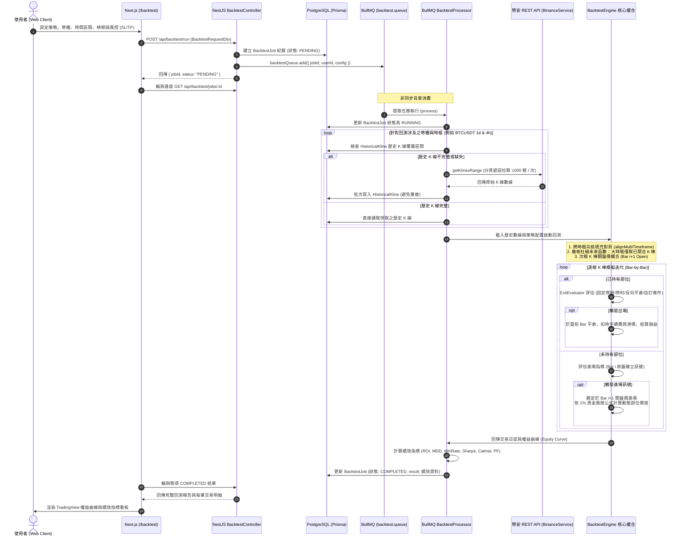

### 核心量化架構設計要點：

1. **嚴格無未來函數 (Zero Look-Ahead Bias)**：
   - 傳統回測最常見的作弊陷阱是在 Bar $i$ 計算指標時使用了尚未走完的收盤價，或在 Bar $i$ 出現訊號時直接以 Bar $i$ 的收盤價或極值成交。
   - 本引擎嚴格規定：**訊號在 Bar $i$ 收盤時確立，撮合引擎強制於 Bar $i+1$ 的開盤價 (Open) 執行**。
   - 所有指標計算嚴格基於已閉合 K 棒，進出場皆在次根 K 棒開盤價撮合，確保實際即時交易時能夠 100% 重現回測結果。
2. **跨時框向前填充 (Multi-Timeframe Forward Fill)**：
   - 當策略同時採用大時框濾網（例如 1D EMA100）與小時框進場（例如 4H 或 15m EMA 金叉）時，小時框必須對齊大時框狀態。
   - 引擎採用**時間戳向前填充 (Forward Fill)**：在主時框（如 4H）某時間點 $T$，僅讀取在大時框上**開盤時間小於等於 $T - \text{大時框週期}$ 且已完全收盤**的指標數值，防止未來大時框數據逆流至小時框。
3. **動態風險部位管理 (Fixed 1% Risk Sizing)**：
   - 為了防範單筆交易劇烈回撤引發爆倉，引擎內建單筆固定風險模型：
     $$\text{Position Value} = \frac{\text{Equity} \times 1\%}{|\text{Stop Loss \%}|}$$
   - 不論使用者設定 3% 還是 10% 的停損距離，該筆交易觸發停損時的實際虧損金額皆精準鎖定在總資金的 1% 左右，槓桿僅用於調節保證金佔用，實現機構級資金管理。
4. **真實摩擦成本模擬 (Friction & Slippage)**：
   - 每筆交易雙向（開倉與平倉）各計入 **0.05% 幣安合約 Taker 手續費** 與 **0.02%~0.05% 市價滑價**。
   - 實證測試表明，此項設置能真實揭露 15m 高頻交易因頻繁交易被手續費嚴重磨損的殘酷真相，避免使用者陷入無摩擦回測的虛假正收益幻覺中。
5. **雙軌風控出場機制 (`ExitEvaluator`)**：
   - **固定停損 (Fixed SL) / 固定停利 (Fixed TP)**：價格觸及閾值立刻離場保本或鎖利。
   - **反向平倉 (Signal Reverse Exit)**：若持有多單時市場出現空方訊號，立即平倉多單，無需等待停利。
   - **自訂指標平倉條件**：支援依據 `EMA`, `SMA`, `RSI`, `MACD`, `PRICE` 組合自訂出場邏輯。

---

## 總結：技術要點

1. **網絡安全防禦縱深**：「Cloudflare ➔ VPC 前綴清單白名單 ➔ Traefik 網關 ➔ 內部網路 (`app-network-prod`)」的四層隔離，特別說明 Prometheus 與資料庫完全隱身在內網。
2. **佇列背壓防禦 (Backpressure & Conflation)**：在 WebSocket 接收行情時，利用 BullMQ 的 `jobId` 覆蓋機制，防止行情快市時 CPU 與記憶體被無窮無盡的任務排隊撐爆。
3. **資料庫原子性與 ORM 級軟刪除 (Database Integrity & Security)**：
   - OAuth 帳號合併時，使用 `Prisma.$transaction` 確保資產轉移與帳號註銷的 ACID 原子性。
   - 實作 **Prisma Client Extension (`softDeleteExtension`)**，在資料庫驅動層級全面攔截 `delete` 動作改為 `deletedAt` 軟刪除更新，並在查詢時自動追加 `deletedAt: null` 過濾與 `password` 欄位隱匿（Omit），以底層機制根除開發者人為遺漏的安全隱患。
   - 行情比對採用**樂觀鎖 (Optimistic Locking)** 技術，藉由 `updatedAt` 條件比對與併發衝突捕獲（Prisma Error `P2025`），防範告警重複觸發或通知重試中的競態條件（Race Condition）。
4. **自適應 API 限流調度與雙軌備援**：整合單執行緒任務佇列、冷熱標的分流（成交量排行與模除分組輪詢）、`X-MBX-USED-WEIGHT-1M` 權重動態延遲反饋，配合 WebSocket 存活狀態檢測的 REST 備援 Cron 機制，實現超低額度開銷的全時段行情同步。
5. **資料庫連接池與 PWA 通知生命週期優化**：
   - 於 `ExtendedPrismaService` 中手動設定 pg Pool 驅動參數（限制 `max: 20`、連線超時與空閒釋放時間），徹底防範高頻查詢時連接洩漏或連接池耗盡。
   - 在推送 Web Push 時自動捕獲 `410 (Gone)` 及 `404` 錯誤，並在資料庫中自動清理失效或過期的 PWA 訂閱憑證，防止無效數據囤積。
6. **零手動部署 (Zero-touch CI/CD)**：從 GitHub 測試、ARM64 跨編譯、ECR 託管到 EC2 自動更新與資料庫遷移，全程由 Code 驅動，無須人工 SSH 介入。
7. **雙 Token 認證與 Session 劫持防禦**：Access Token (30min) + Refresh Token (7d) 架構搭配 HttpOnly Secure Cookie 傳輸、Token Rotation（每次刷新舊 Token 廢棄）、User-Agent 比對偵測 Session 劫持，以及 CSPRNG 驗證碼防暴力破解機制。
8. **策略篩選引擎效能優化**：SHA-256 配置 Hash 快取去重、行情預熱偵測（10% 覆蓋率門檻）、20 並發批次控制、K 線回退即時拉取，確保在 700+ 交易對 × 9 時框的規模下依然秒級回應。
9. **NestJS 七層全域管線**：IP 黑名單 → 速率限制 → JWT 認證 → RBAC 授權 → DTO 白名單驗證 → 業務邏輯 → 日誌/指標/回應格式化，每層獨立可配置，搭配 `__systemLogged` 標記防止日誌重複寫入。
10. **量化回測引擎與撮合機制**：針對量化交易常見的未來函數問題，採次根 K 棒開盤價 (Bar $i+1$ Open) 撮合、跨時框向前填充 (Forward Fill) 對齊、雙向手續費與滑價磨損計入，配合 BullMQ 非同步任務佇列與風險部位動態換算，提供更貼近真實市場的回測評估。
